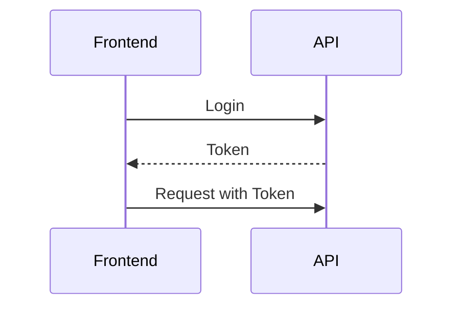

# Meine Erste Homepage

## Team

- Luna J. Fay

## Übersicht

IN ARBEIT DAS IST NUR EIN TEST!

## Installation

```bash
git clone https://gitlab.diamir.tech/coding-school/ss2024/webdevelopment/sumsi-hl.git
npm install
```

Danach öffnen Sie die index.html. auf ihrem PC mit einem funktionierenden Browser.

## Die Seite

<figure>
    
    <figcaption>Vorschau auf das Titelbild.</figcaption>
</figure>

Die gesammte Website wurde mit den vorgegebenen Farben und Styles der Raiffeisenbank designt.
im Header befindet sich das Logo und eine Navigationsleiste die einem zu den wichtigsten Punkten springen lässt.
Die klickbare Navigationsleiste beinhaltet "Teilnahmeinfo", "Sumsi-Galerie" und "Kontakt", indem man auf eines der Begriffe klickt wird man zu der dementsprechenden Section manövriert.

Die Seite ist in 9 Sectionen aufgeteilt:

1. Ganz oben findet man eine Goggle-Übersetzer Button,
2. Darunter kommt der Header,
3. Die Hero-Section mit dem Willkommen,
4. Danach eine kleine Eltern-Info über den Wettbewerb,
5. Dann eine nette Auflistung wie man genau Mitmachen kann,
6. Nochmals wie man mitmachen kann aber in kleinen Schlagwortern,
7. Das Formular zur Teilnahme,
8. Darunter die Gallerie
9. und zum Schluss der Footer.

<figure>
    
    <figcaption>Vorschau auf die Websiteinfo Sektionen.</figcaption>
</figure>

## API

[Die benutzte Api](https://sumsi.dev.webundsoehne.com/docs/)

#### Api calls:

Die API calls wurden mit [Axios](https://www.npmjs.com/package/axios) bzw. mit fetch implementiert.



Um mit dieser API komunizieren zu können braucht man eine Authentifizierung die wird mittels HTTP Basic Auth abgewickelt.

```js
const credentials = {
  email: "admin@csaw.at",
  password: "UZXaTS2jyrbM5j33SPSt",
};

async function getToken() {
  const response = await fetch(`${BASE_URL}/api/v1/login`, {
    method: "POST",
    headers: {
      "Content-Type": "application/json",
      Accept: "application/json",
    },
    body: JSON.stringify(credentials),
  });
  // Prüfen, ob die Antwort HTML ist
  const contentType = response.headers.get("content-type");
  if (!contentType || !contentType.includes("application/json")) {
    const text = await response.text();
    throw new Error(
      `Unexpected content-type: ${contentType}\nResponse: ${text}`
    );
  }

  if (!response.ok) {
    throw new Error(`Error: ${response.status} ${response.statusText}`);
  }

  const data = await response.json();
  token = data.token; // Speichert Tokens in globaler Variable
  console.log("Token:", token);
  return token;
}

getToken().catch(console.error);
```

## Features

### Mehrsprachigkeit

Ganz oben auf der Website kann man einen Google Translator button finden, mit diesem kann aus den Sprachen Englisch oder Deutsch gewählt werden und die Seite wird dementsprechend übersetzt.

<figure>
    
    <figcaption>Vorschau auf das Sprachmenü.</figcaption>
</figure>

### Formular

Mit dem Anmeldeformular kann man wenn man alle notwendigen Daten eigibt ein Bild (von seinem Kind) hochladen.
Alle Felder sind als pflichtfelder markiert da die API alle Daten braucht, auch die Checkboxen müssen angeklickt werden und somit muss der Nutzer auch Zustimmung zu den Urheberrechten, Teilnahme an der Ausstellung und die Zustimmung geben per Email verständigt zu werden.
Schickt man das formular ab, kommt ein Bestätigungsfenster oder eine Fehler meldung wenn etwas fehlgeschlagen ist.

<figure>
    
    <figcaption>Vorschau auf das Formular.</figcaption>
</figure>

### Bilder Hochladen

Pro E-Mail Adresse darf immer nur ein Bild eingereicht
werden. Beim Upload müssen alle Parameter, welche auch in der API Dokumentation zu finden sind, mit
übergeben werden. Auch die Zustimmung der einzelnen Datenschutzthemen muss erfasst werden (wie in abschnitt Formulare angegeben)

### Galerie aufrufen

Hier befindet sich ein Button mit dem man alle eingereichten Bilder aufrufen kann, es werden immer 3 Bilder geladen um die performace stabil zu halten.
der Button ruft immer nur 3 weitere Bilder auf, wenn die Galerie zu ende ist ändert sich dieser Button in einen Schließen button um und schließt die komplette Galerie wieder.

Über jedem Bild wird auch noch angezeigt wie viele Votes dieses Bild hat.

<figure>
    
    <figcaption>Galerie ohne Bilder.</figcaption>
</figure>

<figure>
    
    <figcaption>Galerie.</figcaption>
</figure>

### Das Voting

Pro E-Mail Adresse können 5 Stimmen vergeben werden. Es darf immer nur eine Stimme pro Person und pro Bild vergeben werden.
Es soll auch angezeigt werden, wieviel Bewertungen ein Bild schon hat.

Wenn man auf den "Für Bild voten" Button klickt erscheint ein alert Fenster in das man seine Email addresse hineinschreiben muss, wenn man diese dann abschickt erscheint ein "Vielen dank für dein Voting" Fenster und der Vote erscheint oben im Bild.

<figure>
    
    <figcaption>Voting links oben</figcaption>
</figure>

## Infos und Bedingungen

im Footer gibt es eine Sektion mit Infos bzw. Bedingungen (Datenschutz, Teilnahmebedingungen, Impressum, AGB, Disclaimer, Cookie Richtlinien).
Mit einem klick auf eines dieser Informationen kommt man auf die jeweiligen zu lesenden Schriften.
Darüber befinden sich verlinkungen zu den jeweiligen Socialmedia Plattformen.

<figure>
    
    <figcaption>Der Footer</figcaption>
</figure>

Auf jedes der social Media Icons kann man mit einem klick auf die jeweillige aktuelle Seite gelangen.
Im Kontakt kommt man mit einem klick auf das standort Symbol auf Google-Maps wo die untenstehende Adresse angezeigt wird.
Die Adresse der Raiffeisenbank Landesbank Kärnten.

Darunter befindet sich die Telefonnummer die auch mit einem klick direkt angerufen werden kann und die Email adresse die mit einem klick direkt Outlook aufruft.

### Aufgabenverteilung

| Aufgabe                        | Bearbeitet von |
| ------------------------------ | -------------- |
| HTML struktur                  | Luna           |
| Header                         | Hannah         |
| Token generieren               | Luna           |
| Hero Section                   | Luna           |
| Eltern Information             | Luna           |
| So Funktioniert es Section     | Luna           |
| Mehrsprachigkeit               | Luna           |
| Mitmachen und Gewinnen Section | Hannah         |
| Footer                         | Hannah         |
| Infos und Bedingungen          | Hannah         |
| Teilnahmeformular              | Luna           |
| Galerie                        | Hannah         |
| Bilder hochladen               | Hannah & Luna  |
| Bilder Votings                 | Hannah         |
| Reponsivness                   | Hannah & Luna  |
| Voting Design                  | Hannah         |
| GIT                            | Hannah & Luna  |
| Kontrolle & Lighthouse         | Hannah & Luna  |
| Readme                         | Luna           |

## Languages and Tools

<p align="left"> <a href="https://www.w3schools.com/css/" target="_blank" rel="noreferrer">  </a> <a href="https://git-scm.com/" target="_blank" rel="noreferrer">  </a> <a href="https://www.w3.org/html/" target="_blank" rel="noreferrer">  </a> <a href="https://developer.mozilla.org/en-US/docs/Web/JavaScript" target="_blank" rel="noreferrer">  </a>  </p>
